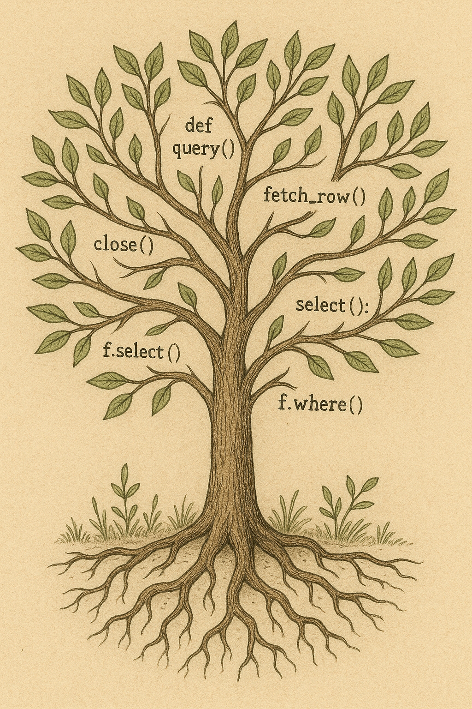

# Some database

We are going to create a relational database together.

All the tutorials and documentation will be available on [Substack](https://tiagoantao.substack.com/).

> [!NOTE]
> In order to learn how to do it - our real objective - we are going to split
> it into several versions
>
> **Each version will be available on a different git branch**

| Version | Description |
|---------|-------------|
| [basic](https://github.com/tiagoantao/some-database/tree/basic) | Basic SQL with `CREATE TABLE`, `INSERT` and `SELECT` |

## Stuff in the main branch

In the main branch there are only Graphviz files that are used in Substack.

You can generate the graphs by doing:

```sh
cd graph
bash run_docker.sh
```

Docker is required.

<div align="center;">
  
</div>
